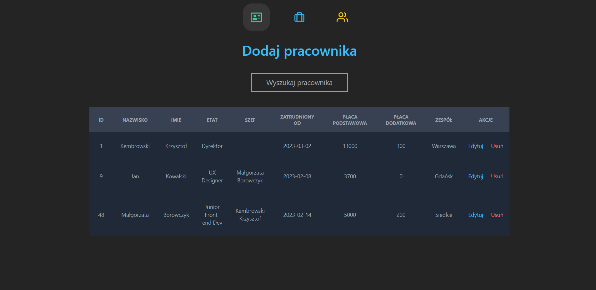
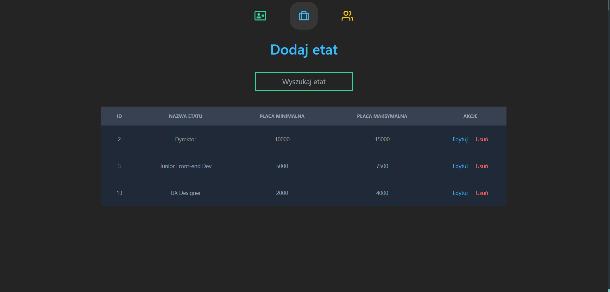
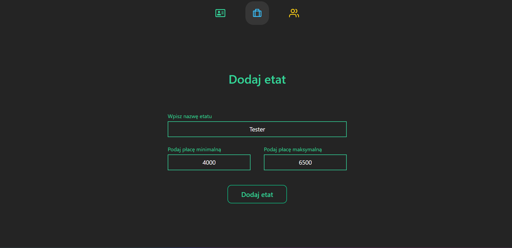
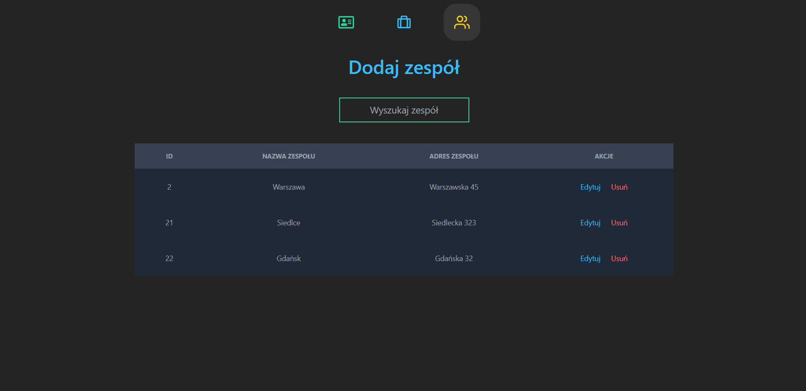
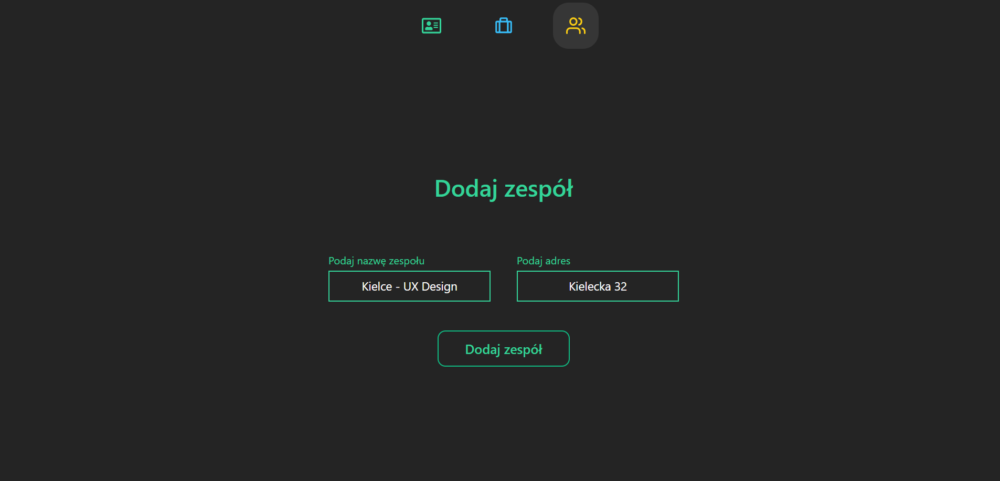

# 🛠️ Workers management system

# 🌐 Preview links:
- 🏠 [Home page](https://workers-propiesek.vercel.app/)
- 👷 [Workers page](https://workers-propiesek.vercel.app/workers)
- 💼 [Job Positions page](https://workers-propiesek.vercel.app/jobPositions)
- 🏢 [Teams page](https://workers-propiesek.vercel.app/teams)

# 📋 Table of Contents

- 📝 [About the app](#📝-about-the-app)
  - 🎯 [Features](#🎯-features)
- 🚀 [Motivation](#🚀-motivation)
- 🔧 [Technology stack](#🔧-technology-stack)
- 📸 [Screenshots](#📸-screenshots)
  - 👷‍♀️ [Workers page](#👷‍♀️-workers-page)
    - 🔍 [All workers](#🔍-all-workers)
    - ➕ [Add / edit a worker](#➕-add--edit-a-worker)
  - 💼 [Job positions](#💼-job-positions)
    - 🔍 [All job positions](#🔍-all-job-positions)
    - ➕ [Add / edit a job position](#➕-add--edit-a-job-position)
  - 🏢 [Teams page](#🏢-teams-page)
    - 🔍 [All teams](#🔍-all-teams)
    - ➕ [Add / edit a team](#➕-add--edit-a-team)
- 📞 [Contact](#📞-contact)

# 📝 About the app
Application for managing workers, their job positions and teams.

## 🎯 Features

- ➕ creating and managing workers, job positions and teams
- 🔍 filtering them by search

# 🚀 Motivation
I built this app as a school assignment, that's why it's in Polish.

I had to deploy it somewhere, but since there aren't many places where I can host Node.js app for free, I decided to learn Next.js.

With Next, I could deploy it on Vercel, both back-end and front-end, which was sooo nice.

I learned some Redux Toolkit with this project, but I think it was a bit of a overkill.

I wanted to have a fast UI, which wouldn't have to wait for back-end to respond, but now when I look at it, I think I should've sticked with awaiting for back-end updates.

# 🔧 Technology stack

- [Next 13 (React)](https://nextjs.org/) - For front-end and back-end
- [Tailwind](https://tailwindcss.com/) - For styling
- [Redux (toolkit)](https://redux-toolkit.js.org/) - For managing state between all 3 tables as they were related, for instant updates on front-end 
- [supabase](https://supabase.com/) - As the database
- [Prisma](https://www.prisma.io/) - As a ORM for database
- [Formik](https://formik.org/) - For managing forms
- [Vercel](https://vercel.com/) - For deployment

# 📸 Screenshots

## 👷‍♀️ Workers page
### 🔍 All workers

### ➕ Add / edit a worker

## 💼 Job positions
### 🔍 All job positions

### ➕ Add / edit a job position

## 🏢 Teams page
### 🔍 All teams

### ➕ Add / edit a team

# 📞 Contact
Feel free to contact me, message me on Discord @macias#9277 😄🙏.